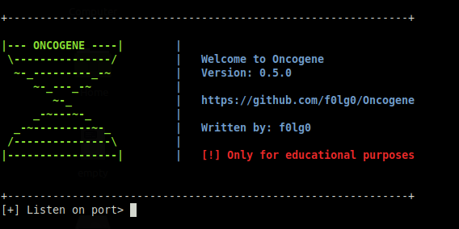
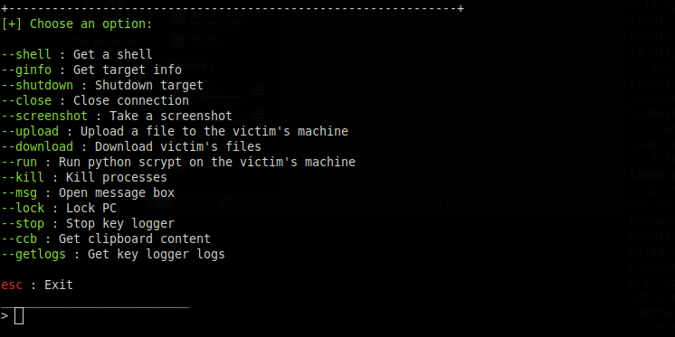
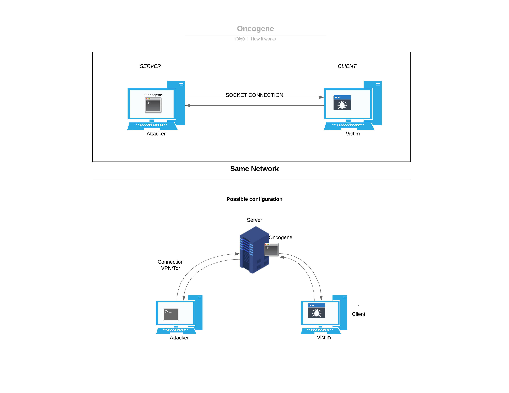

# Oncogene

Logo								  | Main Menu
:-----------------------------------: | :-----------------------------------:
     | 

# DISCLAIMER

**Oncogene is meant to be used only for educational/reasearch purposes. I am not responsable for any kind of damage caused by this tool.
Downloading this means that you agree to use it at YOUR OWN RISK. Use this tool locally on your own enviromnent.
Thanks.**

# About Oncogene

A simple Windows backdoor/RAT + KeyLogger written in Python using sockets.

# NOTE
I've developed Oncogene in a Linux environment, it may not work under other systems. This backdoor targets Windows but the attacker should use Linux. 

## How does it work?



The attacker runs the Oncogene python script which starts a socket server on a specific port, it must be the same one as the one that the client (or the victim) will use to connect to the attacker's server.

Once a connection has been established the attacker can execute some commands such as screenshotting the victim's desktop, downloading and uploading files, getting a simple shell and so on.

## Instructions

In order to use this tool you need to tweak some things inside the scripts: inside clientwin.py you must replace the value for the Server IP. You can change the port number if you want, the default one is 1234. Inside oncogene.py everything should be fine, the script grabs automatically the host's IP address; you may need to change this value inside /etc/hosts since it can't be localhost. If you plan to use the non-default backup feature then inside backup.py you need to change the values for email and password. Inside the defualt backup feature b2.py you need to modify the server's IP address. Don't worry about what those features are, scrool down and find the explaination. 

If you want to deploy the malware then inside launcher.py you need to change the paths for the .exe that you will create. Scroll down to the "Deploying" section where I will explain you how to setup everything.

Check the comments inside the source code to guide yourself through the setup process.

### Deploying Oncogene

In order to deploy this malware you need to get dirty hands: you need to pack the code into an executable Windows file.

#### You need:
- Pyinstaller 
- A Windows machine

Once the requirements are satisfied you have to run these commands inside a CMD instance:

#### Run

```
pyinstaller --onefile --noconsole launcher.py
```

```
pyinstaller --onefile --noconsole b2.py
```

You can even use backup.py if you want. B2 is the defualt one which I reccomend.

```
pyinstaller --onefile --noconsole clientwin.py
```

Go grab the 3 .exe inside the newly created "dist" folder and place them together in a folder you want. You can leave them there if you want but I suggest you to move them into another folder.

#### Front program

Once this is done you need to grab a front-program, this will be the .exe that the victim will interact with not knowing that a malware is running in the background. It can be whatever you want, I personally used minesweeper. You can grab a free copy of it on the Internet.

#### Done!

Modify the things that I described into the "Instruction" section and you are ready to deploy this malware!

If you just want to test this backdoor without packing everything inside executables then you can just run the python scripts.


Let's imagine that you want to distribute this malware (you shouldn't).

The launcher.exe is the main file, the idea is to rename it to whatever you want (for example: minesweeper.exe): you want to fool the victim by making him launch the game exe which, in reality, launches the front program exe (the real minesweeper.exe) and the backdoor.exe in a hidden window instance. Basically, to the victim's eye will appear only the real program interface but the backdoor will be ran in a hidden way in the background.

Closing the real program window WON'T stop the backdoor (that's the cool part); to stop it you have to terminate the process in TaskManager or by choosing the option "--close" on the attacker's side.

There's also a backup feature to retreive the keylogger files if the target stops the backdoor: the launcher.exe will also run a small script (in .exe format) which will try to send the logs to the attacker. Scroll down to find the dedicated section.

## What's inside this repo?

There are mainly 2 Python scripts excluding the displayBanner and mainMenu files: "oncogene.py" for the attacker (Linux),  and "clientwin.py" for Windows machines.

There's also the launcher.exe (and the source script) which can be used to deploy the backdoor in real life.

## Features

* Reverse Shell
* Get target informations (OS, IP..)
* Shutdown the target
* Screenshot
* Upload files
* Download files in a zip archive
* Get Key Logger logs
* Run additional Python scripts
* Close the connection
* Get clipboard
* Kill processes (TaskManager) 
* Display a message box 
* Lock PC 

## Requirements

### Server

* ZipFile

### Client (Python script)

* mss
* ZipFile
* Pynput
* pyperclip

### Client (.exe)

Everything should work even without having Python installed

## Run

### Server

```
python3 oncogene.py
```

### Client (Python script)

```
python3 client.py 
```
Or if you only have python3

```
python clientwin.py
```

## Backup feature

I've implemented two ways of retreiving the keylogger files if the connnection gets cut, so even if the victim stops the backdoor you are able to get the keylogger files in two different ways: by establishing another connection to the victim on a different port (with another script) or by using my backup script that uploads the logs to MEGA. You obviously need a MEGA account.

The first option is the DEAFULT one, so if you want to use the second you have to do a little bit of tweaking: you need to comment out the backupConnection function in the Oncogene.py file and replace the "backupexe" path in the launcher script with the correct .exe (the MEGA one).

## Why did I build it?

I was working on a simple terminal-based chat application using sockets in Python (soon available) and I thought about all I could do with sockets without the user even knowing.
The 'dark idea' quickly got me hooked up in the cybersecurity world and I decided to build this tool to test my abilities. I remind you that I AM A BEGINNER in Python and this isn't a perfectly written piece of code so feel free to give me advice but please DON'T BE RUDE.
Thanks for downloading and using Oncogene!

## What about the name?

An oncogene is a gene that has the potential to cause cancer. In tumor cells, these genes are often mutated, or expressed at high levels.

So this tool lies behind a "normal" program and once activated it can cause severe damage to the victim.

## Use case scenario

This is a simple yet powerful way to attack a computer (but remember: hacking people is easier than hacking PCs!). The user downloads a "front-program" distribuited by the attacker with hidden inside this backdoor: A script runs both the "normal" program and the backdoor at the same time using threads. Once the attacker gets a connection the numbers of possible actions is pretty huge.

Oncogene can also be used for transfering files easily, monitoring and controlling a PC remotely with the consent of the user. 

_Is your son playing too much videogames?_

_Just shutdown his computer remotely with Oncogene!_

## Advantages of Oncogene

Keep in mind that Oncogene isn't a super sophisticated tool but it is:

* Light weight  
* Fast
* Easy to use, to understand and to modify
* FREE
* Costantly under development

## COMING SOON!

- Port for Linux machines 
- Keylogger files encryption

## FAQs

### _Can I (attacker) be tracked?_

Yes. If someone sniffs the connection between the server and the client it can go back to the server's IP. One solution might be running Oncogene on a "neutral" machine and connect to it securely with a VPN or with Tor.

### _Who are you?_

I am just a teenager who loves learning and testing his abilities.

#### Ask me anything!

## LICENSE

[License](./LICENSE)

### Thanks

I would like to thank my IT school teacher who constantly helps and supports me.
